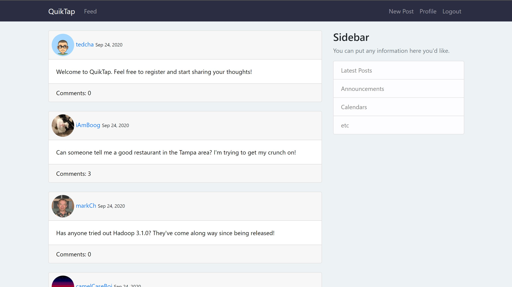

# QuikTap

QuikTap is a twitter-like web application developed with Django. The concept of the social media website is to be able to share short or "Quik" thoughts with your friends in a rapid manner that promotes impactful but swift discussion.

## About

This project is my second time delving into the wonderful Django framework.

I developed the following components for the website:
* Post Feed
* Posts
* Comments
* Profiles
* CRUD Abilities (For Posts, Comments, and Profiles)
* User Registration
* User Authentication

Topics I learned more about and got to work with during development:
* Django Migrations
* Django Forms
* Django Apps
* Django URL Routing/Patterns
* Django Views
* Django Pagination
* Django Signals
* Templates
* Bootstrap4 Implementation
* Django Function Based Views
* Django Class Based Views
* Postgres Database Setup
* AWS S3 Bucket for Image Storage
* Heroku Deployment

It was a lot of fun delving into Django and getting a better understanding of it's inner workings.

## Usage

**There are two ways to view/use the website:**

### Heroku Instance

Click [here](https://quiktap.herokuapp.com/) to visit the Heroku instance.

### Local Instance

To use the website on your own local instance, follow the instructions below.

Clone this repository using the "Clone or download" button in the top right corner of the repository or by using the git clone command:
```bash
git clone https://github.com/tcharts-boop/quiktap.git
```
#### Development Environment

After the repository is cloned you'll have to download the required dependencies.
For this project, I utilized Pipenv to track my dependencies.

While in the top level directory `quiktap` (*Note: Not `quiktap\quiktap`*) run the following command:
```bash
pipenv install
```

This will setup a pipenv environment and install all of the dependencies to the environment.

To activate the environment, use the following command:
```bash
pipenv shell
```
#### Migrations, Super User, and Run Server

While in the pipenv environment, run the following command to make migrations to create your database (sqlite3):
```bash
python manage.py makemigrations
```

To actually run the migrations, use the following command:
```bash
python manage.py migrate
```

From there, your database is setup but you'll want to make a super user to access the admin panel:
```bash
python manage.py createsuperuser
```

Lastly, run the development server:
```bash
python manage.py runserver
```

The website should now be available at `localhost` (*Note: Django defaults to http://127.0.0.1:8000/*).

You will have to change some of the variables in settings.py as they are set to my local Environment Variables.

## Development

If you would like to use the website and develop it further, please feel free to create a local instance of the website using the guide above!

### Dependencies
The required dependencies can be installed from the Pipfile, but a list of dependencies can be seen below:

* [python 3.8](https://www.python.org/)
* [django 3.0.7](https://www.djangoproject.com/)
* [django-crispy-forms 1.9.2](https://django-crispy-forms.readthedocs.io/en/latest/)
* [django-cleanup 5.1.0](https://pypi.org/project/django-cleanup/)
* [boto3 1.15.4](https://boto3.amazonaws.com/v1/documentation/api/latest/index.html)
* [django-storages 1.10.1](https://django-storages.readthedocs.io/en/latest/)
* [gunicorn 20.0.4](https://gunicorn.org/)
* [django-heroku 0.3.1](https://pypi.org/project/django-heroku/)
* [pillow 7.2.0](https://pillow.readthedocs.io/en/stable/)
* [django-imagekit  4.0.2](https://github.com/matthewwithanm/django-imagekit)

### File Structure

```bash
quiktap
├───posts
│   ├───migrations
│   ├───templates
│   │   └───posts
├───quiktap
├───static
│   └───css
├───staticfiles
├───templates
└───users
    ├───migrations
    └───templates
        └───users
```
## Gallery

Front Page:


Post Detail:


User Profile:


## Credit/Acknowledgment

A big thank you to [Corey Schafer](https://www.youtube.com/c/Coreyms). 
His [Django Tutorials](https://www.youtube.com/playlist?list=PL-osiE80TeTtoQCKZ03TU5fNfx2UY6U4p) are absolutly amazing and were used as reference during the entire development process.

Also, a big thank you to all of the dependency authors/contributors. Their packages made development in Django an absolute breeze.

## License
MIT License

Copyright (c) 2020 Ted

Permission is hereby granted, free of charge, to any person obtaining a copy
of this software and associated documentation files (the "Software"), to deal
in the Software without restriction, including without limitation the rights
to use, copy, modify, merge, publish, distribute, sublicense, and/or sell
copies of the Software, and to permit persons to whom the Software is
furnished to do so, subject to the following conditions:

The above copyright notice and this permission notice shall be included in all
copies or substantial portions of the Software.

THE SOFTWARE IS PROVIDED "AS IS", WITHOUT WARRANTY OF ANY KIND, EXPRESS OR
IMPLIED, INCLUDING BUT NOT LIMITED TO THE WARRANTIES OF MERCHANTABILITY,
FITNESS FOR A PARTICULAR PURPOSE AND NONINFRINGEMENT. IN NO EVENT SHALL THE
AUTHORS OR COPYRIGHT HOLDERS BE LIABLE FOR ANY CLAIM, DAMAGES OR OTHER
LIABILITY, WHETHER IN AN ACTION OF CONTRACT, TORT OR OTHERWISE, ARISING FROM,
OUT OF OR IN CONNECTION WITH THE SOFTWARE OR THE USE OR OTHER DEALINGS IN THE
SOFTWARE.
